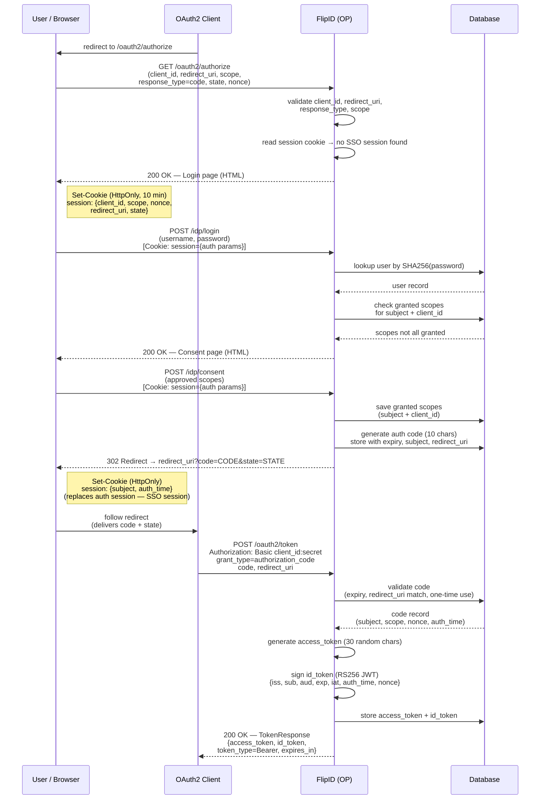
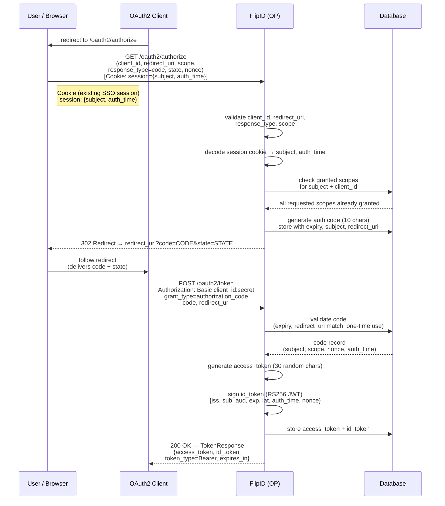

# Architecture

The project is organized in Rust modules

## 1. CORE

- contains common code
- embedded in the other modules
- should use as few dependencies as possible. Only what can be usefull accross modules (like logging, utilities...)

## 2. DB

- handles communications with an RDBMS
  - currently only sqlite is supported
- it should be used by the other modules, through an abstract layer (interface), that should allow us to swap an RDBMS with LDAP, or file based db

## 3. OIDC

- implements the Oauth2/Opend Id Connect protocol endpoints
- context-path: `/op`

| Path                              | Name                     | Support |
|-----------------------------------|--------------------------|--|
| /oauth2/authorize                 | Authorization Endpoint   | oidc (draft) |
| /oauth2/token                     | Token Endpoint           |  |
| /oauth2/token_info                | Introspection Endpoint   |  |
| /oauth2/user_info                 | UserInfo Endpoint        |  |
| /.well-known/openid-configuration | OpenID Connect Discovery |  |
| /.well-known/jwks.json            | JWK Set                  |  |

## 4. IDP

- implements IDP specific endpoints, that are not protocol specific
- context-path: `idp`

| Path              | Name                  | Support |
|-------------------|-----------------------|--|
| /idp/login        | Login Page            |  |
| /idp/consent      | Consent Page          |  |
| /idp/cancel       |         |  |

### 4.1 Login-UI

Currently represented as static html pages, it will evolve into an SPA implementing all the required pages (login, consent, registration, etc).
The technology is to be decided (probably VueJS).

---

## 5. Authorization Code Flow

### 5.1 Full Flow (Fresh Login with Consent)

The complete login journey for a user with no existing session and scopes that have not yet been granted.

### 5.2 SSO Flow (Existing Session, All Scopes Already Granted)

When the user already has a valid SSO session cookie and all requested scopes were previously granted, the login and consent steps are skipped entirely.

### 5.3 Session Cookie vs. Auth Code

| Artifact | Created at | Stored in | Purpose |
|---|---|---|---|
| Auth session cookie | `GET /oauth2/authorize` | Encrypted HTTP-only cookie (10 min) | Carries `client_id`, `scope`, `nonce`, `redirect_uri`, `state` across the login/consent pages |
| SSO session cookie | After successful login or consent | Encrypted HTTP-only cookie | Carries `subject` + `auth_time` for future SSO reuse |
| Authorization code | After login/consent | Database (one-time use, configurable TTL) | Short-lived token exchanged for final tokens at `/oauth2/token` |
| Access token | `POST /oauth2/token` | Database | Opaque bearer token (30 random chars) |
| ID token | `POST /oauth2/token` | Database | RS256-signed JWT with OIDC claims |
